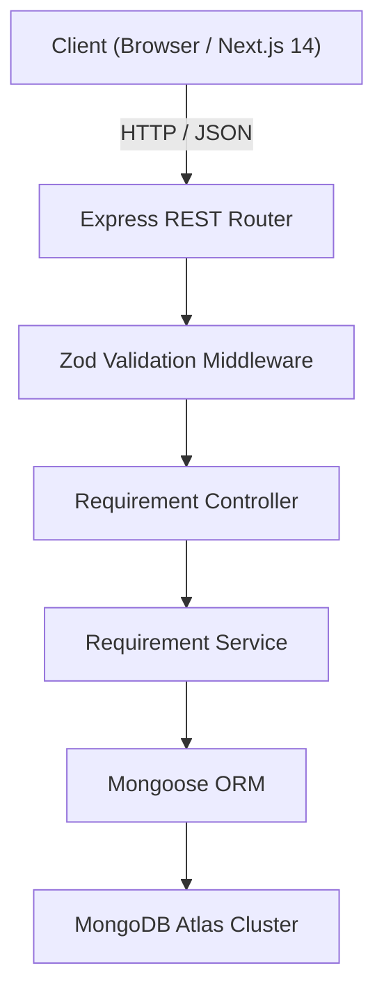

# EventFlow — Requirement Posting & Events Management Platform

EventFlow is a fullstack event requirement management application built with **Next.js 14 (App Router)**, **Node.js + Express**, and **MongoDB Atlas**. It delivers a high-end crimson glassmorphic user experience inspired by frosted optical depth, fluid animations, and a structured 4-step wizard that adapts dynamically to three distinct industry categories: **Event Planners**, **Performers**, and **Event Crew/Staff**.

---

## Table of Contents

1. [Architecture & Technology Stack](#architecture--technology-stack)
2. [Visual Design System & Glassmorphism](#visual-design-system--glassmorphism)
3. [4-Step Requirement Posting Flow](#4-step-requirement-posting-flow)
4. [Events Directory & Management](#events-directory--management)
5. [Backend API Reference](#backend-api-reference)
6. [Data Validation & Schema Architecture](#data-validation--schema-architecture)
7. [Getting Started & Local Setup](#getting-started--local-setup)
8. [Project Structure](#project-structure)

---

## Architecture & Technology Stack



### Frontend
- **Framework**: Next.js 14 (App Router, Server & Client Components)
- **Styling**: Tailwind CSS with custom glassmorphism, crimson radiance tokens, and responsive utility layers
- **Icons**: Lucide React
- **Typography**: Inter (optimized through `next/font/google`)

### Backend
- **Runtime**: Node.js (TypeScript via `ts-node-dev`)
- **Web Framework**: Express.js 4.21
- **Database**: MongoDB Atlas via Mongoose 8.9
- **Validation**: Zod 3.24 (Discriminated union schemas with refinement guards)
- **Documentation**: Swagger UI & OpenAPI 3.0 (`/api-docs`)
- **CORS**: Configured for local and cross-origin frontend requests

---

## Visual Design System & Glassmorphism

The interface implements a high-contrast dark crimson glassmorphic visual language:

### 1. Static Dual-Tone Background Geometry
Instead of a flat uniform background, the root layout features static, responsive background spheres positioned to create high visual contrast across the viewport:
- **Upper Region**: Deep wine/black sphere (`#22060b` to `#090204`)
- **Lower Center**: Vivid glowing scarlet/crimson sphere (`#ff1a3c` to `#8a0717`) with a wide ambient blur shadow
- **Flanking Geometry**: Left and right curved ambient discs creating subtle side reflections

### 2. Frosted Glass Refraction
The primary content container (`GlassCard`) utilizes `backdrop-blur-2xl` with a translucent white gradient (`from-white/[0.09]` to `to-white/[0.01]`), a crisp `border-white/20` highlight, and an inner top glare line. When centered over the background, the boundary between the dark upper sphere and the vivid lower red sphere refracts through the frosted glass, illuminating the bottom half of the card.

---

## 4-Step Requirement Posting Flow

```
Step 1: Event Basics & Category Selection
   ↓
Step 2: Category Scope (Adapts to Planner / Performer / Crew)
   ↓
Step 3: Category Logistics & Parameters (Adapts to Planner / Performer / Crew)
   ↓
Step 4: Summary Review & Direct MongoDB Persistence
```

### Step 1: Event Basics
- **Fields**:
  - `eventName` (String, required): Event title
  - `eventType` (Select, required): Corporate, Wedding, Concert, Festival, Sports, Workshop, etc.
  - `startDate` (Date, required): Kickoff date
  - `endDate` (Date, optional): Concluding date
  - `location` (String, required): City, State/Region
  - `venue` (String, optional): Specific venue or facility name
- **Category Selector**:
  - **Event Planner**: Coordination, vendors, budget, and overall execution
  - **Performer**: Musicians, DJs, solo acts, speakers, and live entertainment
  - **Crew / Staff**: AV technicians, stage hands, security, and operations personnel

---

### Step 2 & 3: Category-Specific Adapting Steps

The wizard dynamically switches its form controls and validation rules based on the category chosen in Step 1:

| Category | Step 2 (Scope & Scale) | Step 3 (Logistics & Specifications) |
| :--- | :--- | :--- |
| **Event Planner** | • Expected Guest Count (`attendeeCount`)<br>• Required Services Checklist (`servicesNeeded`: Catering, Photo, Decor, Audio, etc.) | • Budget Range: Min & Max ($) (`budgetMin`, `budgetMax`) with `max >= min` validation<br>• Timeline Flexibility (`fixed` vs `flexible`) |
| **Performer** | • Act / Performance Type (`performanceType`: DJ, Band, Solo, Comedian, etc.)<br>• Set Duration in minutes (`durationMinutes`)<br>• Expected Audience Size (`audienceSize`) | • Stage & PA Equipment Provided by Venue (`equipmentProvided`: Yes / No)<br>• Genre / Musical Style Preference (`genrePreference`, optional) |
| **Crew / Staff** | • Crew Specialization (`crewType`: Audio/Visual, Rigging, Lighting, Security, etc.)<br>• Headcount Needed (`numberOfCrew`) | • Shift Window: Start & End timestamps (`shiftStart`, `shiftEnd`) with chronological validation (`end > start`)<br>• Special PPE / Safety Gear Required (`equipmentRequired`: Yes / No) |

---

### Step 4: Summary Review & Submission
- Formats and displays all basic and category-specific parameters in a structured review card.
- Submits payload to `POST /api/requirements`.
- Renders confirmation modal with direct links to view the newly created event in the Events Directory or post another requirement.

---

## Events Directory & Management

Accessible at `/events`, this interface integrates with all backend endpoints:

1. **Category Filter Tabs with Live Counters**:
   - `All Events`, `Planners`, `Performers`, and `Crew & Staff`.
   - Utilizes `GET /api/requirements?category=<category>` for targeted database queries.
2. **Live Search**:
   - Instant client-side search filtering by event title, city, venue, or event type.
3. **Structured Event Cards**:
   - Shows event dates, location, category badges, and quick-glance metrics (e.g. Budget range, Act type, or Headcount).
4. **Structured Detail View Modal**:
   - Fetches single requirement data via `GET /api/requirements/:id`.
   - Displays all specifications in clean, formatted UI cards and tags (eliminating raw JSON).
5. **Delete Functionality**:
   - Includes a confirmation dialog that triggers `DELETE /api/requirements/:id`.
   - Features optimistic UI removal so the deleted card disappears immediately upon confirmation.

---

## Backend API Reference

Base URL: `http://localhost:5000` (Swagger UI at `http://localhost:5000/api-docs`)

### Endpoints

| Method | Route | Description | Query / Body Parameters | Success Response |
| :--- | :--- | :--- | :--- | :--- |
| `GET` | `/health` | Server health check | None | `200 OK` `{ status: "ok" }` |
| `GET` | `/api/requirements` | List requirements | Optional: `?category=planner\|performer\|crew` | `200 OK` `{ success: true, data: [...] }` |
| `GET` | `/api/requirements/:id` | Fetch requirement by ID | Path: `id` (MongoDB ObjectId) | `200 OK` `{ success: true, data: {...} }` |
| `POST` | `/api/requirements` | Create requirement | Body: JSON validated by Zod schema | `201 Created` `{ success: true, data: {...} }` |
| `DELETE` | `/api/requirements/:id` | Delete requirement | Path: `id` (MongoDB ObjectId) | `204 No Content` |

---

## Data Validation & Schema Architecture

All incoming POST payloads are strictly validated using **Zod** discriminated unions on the `category` field:

```typescript
// Shared Event Basics Schema
const eventBasicsSchema = z.object({
  eventName: z.string().trim().min(1, "Event name is required"),
  eventType: z.string().trim().min(1, "Event type is required"),
  startDate: isoDateOrDateString,
  endDate: isoDateOrDateString.optional(),
  location: z.string().trim().min(1, "Location is required"),
  venue: z.string().trim().optional(),
});

// Category Discriminated Union
export const createRequirementSchema = z.discriminatedUnion("category", [
  z.object({ category: z.literal("planner"), details: plannerDetailsSchema }).merge(eventBasicsSchema),
  z.object({ category: z.literal("performer"), details: performerDetailsSchema }).merge(eventBasicsSchema),
  z.object({ category: z.literal("crew"), details: crewDetailsSchema }).merge(eventBasicsSchema),
]);
```

### Validation Guards:
- **Planner**: `budgetMax >= budgetMin`, `attendeeCount > 0`, and `servicesNeeded.length >= 1`.
- **Performer**: `durationMinutes > 0`, `audienceSize > 0`, and `equipmentProvided` boolean.
- **Crew**: `numberOfCrew > 0`, `shiftEnd > shiftStart`, and `equipmentRequired` boolean.
- **Global**: If `endDate` is supplied, it must satisfy `endDate >= startDate`.

---

## Getting Started & Local Setup

### Prerequisites
- Node.js 18+ (tested on Node v26)
- MongoDB Atlas cluster URI or local MongoDB instance

### 1. Backend Setup
```bash
cd backend
npm install
```
Configure `backend/.env`:
```env
PORT=5000
MONGODB_URI=your_mongodb_connection_string
```
Start the backend development server:
```bash
npm run dev
# Server runs on http://localhost:5000
# Swagger API docs available at http://localhost:5000/api-docs
```

### 2. Frontend Setup
```bash
cd ../frontend
npm install
```
Configure `frontend/.env.local`:
```env
NEXT_PUBLIC_API_URL=http://localhost:5000
```
Start the Next.js development server:
```bash
npm run dev
# Application runs on http://localhost:3000
```

To run a production build:
```bash
npm run build
npm start
```

---

## Project Structure

```
fullstack task/
├── README.md                      # Project documentation
├── backend/
│   ├── .env                       # Backend environment variables
│   ├── package.json
│   ├── tsconfig.json
│   └── src/
│       ├── app.ts                 # Express configuration & Swagger setup
│       ├── server.ts              # Entry point & DB connection
│       ├── config/db.ts           # Mongoose Atlas connection
│       ├── controllers/           # HTTP controllers
│       ├── middleware/            # Validation & error handlers
│       ├── models/Requirement.ts  # Mongoose schema
│       ├── routes/                # API routes
│       ├── schemas/               # Zod validation schemas
│       ├── services/              # Business logic & DB queries
│       └── utils/                 # AppError & response helpers
└── frontend/
    ├── .env.local                 # Frontend environment variables
    ├── package.json
    ├── tailwind.config.ts         # Glassmorphic & crimson design tokens
    ├── components/
    │   ├── Navbar.tsx             # Universal floating glass navigation
    │   ├── GlassCard.tsx          # Frosted glass card with dual glare
    │   ├── ProgressBar.tsx        # 4-step progress indicator
    │   ├── CategoryCard.tsx       # Glowing category selection cards
    │   ├── StepBasics.tsx         # Step 1: Event Basics
    │   ├── StepCategoryScope.tsx  # Step 2: Adaptive Scope
    │   ├── StepCategoryLogistics.tsx # Step 3: Adaptive Logistics
    │   └── StepReview.tsx         # Step 4: Review & Submit
    ├── lib/
    │   └── api.ts                 # Type-safe API client for all endpoints
    └── app/
        ├── layout.tsx             # Root layout with static background spheres
        ├── globals.css            # Custom glass utilities & scrollbars
        ├── page.tsx               # 4-Step Requirement Wizard page
        └── events/
            └── page.tsx           # Events Directory & Management page
```
